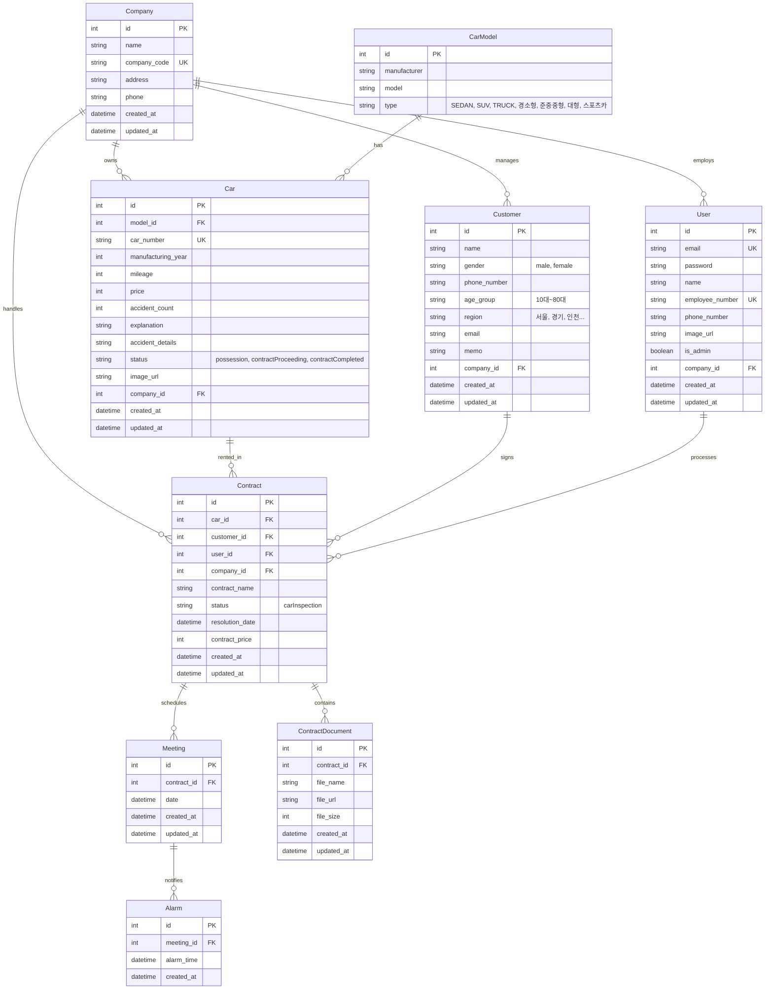

## 💡 프로젝트 주제 - Dear Carmate

렌터카 관리 시스템 백엔드 API 서버

- [[프로젝트가이드]](https://www.notion.so/bec107dd4ac04d3f910900303cdfd8c9?pvs=21)
- [[API명세서]](https://www.notion.so/f18aa80a25a54555b25b08652c36763a?pvs=21)

---

## 🚀 초기 세팅 완료 항목

### 1. 개발 환경 설정
- ✅ Node.js + TypeScript 프로젝트 초기화
- ✅ Express.js 설치
- ✅ PostgreSQL 연동 준비

### 2. 코드 품질 도구
- ✅ ESLint 설정 (TypeScript)
- ✅ Prettier 설정
- ✅ Husky + lint-staged (pre-commit hook)
  - 커밋 전 자동으로 `eslint --fix`, `prettier --write`, `tsc --noEmit` 실행

### 3. 데이터베이스
- ✅ Prisma ORM 설정
- ✅ Database Schema 설계 완료 (9개 모델)
  - Company, User, CarModel, Car, Customer, Contract, Meeting, Alarm, ContractDocument
- ✅ ERD 문서화

### 4. 프로젝트 구조
- ✅ Layered Architecture 기본 폴더 구조
  ```
  src/
  ├── controllers/
  ├── services/
  ├── repositories/
  ├── models/
  ├── types/
  └── utils/
  ```

### 5. 테스트 환경
- ✅ Vitest 설치 및 설정

---

## ⚙️ 기술 스택

| **분류** | **기술** |
| --- | --- |
| Runtime | Node.js |
| Language | TypeScript |
| Framework | Express.js |
| Database | PostgreSQL |
| ORM | Prisma |
| Validation | Zod |
| Test | Vitest |
| Code Quality | ESLint, Prettier, Husky |
| API 문서화 | Swagger (예정) |
| 협업 도구 | Discord, GitHub, Notion |

# 🧩 규칙 수립

### 리포/깃 운영

| **항목** | **내용** |
| --- | --- |
| 네이밍 컨벤션 | camelCase (변수, 함수), PascalCase (클래스), kebab-case (파일) |
| 커밋 컨벤션 | `feat`, `fix`, `refactor`, `docs`, `style`, `test`, `chore` 등 작성 
예시)
Feat: "회원 가입 기능 구현"

SMS, 이메일 중복확인 API 개발

Related to: #48, #45 |
| 브랜치 전략 | `main`, `feature/기능명`, `bugfix/이슈번호` |
| PR 규칙 | 2명 이상 Approve 시 Merge |
| 깃허브 이슈 컨벤션 | 라벨→ todo, todo-details, 버그, 개발, 수정, 테스트

todo 템플릿

todo 작성 방법→ `Title` 은 `[이름 | 오늘날짜] 하루간 할 내용 요약` 형식으로 작성해 주세요 (날짜는 MMDD 형식으로 작성해 주세요)
ex) [지인호 | 0910] 로그인 및 회원가입 로직 개발

내용은 다음과 같이 작성해주세요 
`- [ ] 오늘 할 내용 - 001
- [ ] 오늘 할 내용 - 002
- [ ] 오늘 할 내용 - 003` |

### 코드/품질 개선

| 항목 | 내용 |
| --- | --- |
| Husky + lint-staged | 커밋 전  `eslint --fix`/`prettier --write`/`typecheck` 체크 |
| test 툴 | vitest library (백앤드 앤드포인트 테스트) |

### 데이터 규칙

| 항목 | 내용 |
| --- | --- |
| tsconfig.json | `"strict": true`
`"paths": { "@/*": ["src/*"], }` |
| 공통 DTO/스키마 | zod |
| 에러 | 에러 포맷 통일 및 `errorHandler.ts`를 사용하여 미들웨어로써 공통적으로 에러처리 |
| DB 트랜잭션 규칙 | 대용량 업로드·대시보드 집계 쿼리는 반드시 트랜잭션 사용 |
| 폴더 구조 | Layered Architecture 기법 사용하여 폴더 구조 정리 |

### 협업/운영 규칙

| 항목 | 내용 |
| --- | --- |
| 주간 점검 | 프로젝트 기간내 오전시간에는 PR(있을시) 리뷰/머지 |
| 디스코드 알림 | PR 혹은 이슈 발생시 디스코드 웹훅 기능으로 알림 |
| PR 규칙 | 2명 이상 리뷰 후 merge, merge 후 원격 브랜치 삭제 |

### API 명세서
https://codeit.notion.site/f18aa80a25a54555b25b08652c36763a?v=6e6e829603024656b7f5cfd24871b5f1&pvs=143

---

# Database ERD

## 엔티티 관계 다이어그램



## 테이블 설명

### Company (회사)
렌터카 회사 정보를 관리하는 테이블입니다.
- **필수 필드**: companyCode (회사 코드, 유니크)
- **관계**: User, Car, Customer, Contract와 1:N 관계

### User (유저/직원)
회사의 직원 정보를 관리하는 테이블입니다.
- **역할**: isAdmin (true: 관리자, false: 일반 직원)
- **필수 필드**: employeeNumber (사번, 유니크), email (유니크)
- **관계**: Company와 N:1 관계, Contract와 1:N 관계

### CarModel (차량 모델)
차량 모델 정보를 관리하는 마스터 테이블입니다.
- **타입**: SEDAN, SUV, TRUCK, 경·소형, 준중·중형, 대형, 스포츠카 등
- **관계**: Car와 1:N 관계
- **제약조건**: (manufacturer, model) 조합으로 유니크 제약

### Car (차량)
실제 보유 차량 정보를 관리하는 테이블입니다.
- **상태**: possession (보유), contractProceeding (계약 진행 중), contractCompleted (계약 완료)
- **필수 필드**: carNumber (차량 번호, 유니크), price (가격), manufacturingYear (제조년도)
- **사고 정보**: accidentCount (사고 횟수), accidentDetails (사고 상세)
- **관계**: Company, CarModel과 N:1 관계, Contract와 1:N 관계

### Customer (고객)
렌터카 고객 정보를 관리하는 테이블입니다.
- **필수 필드**: name, gender (male/female), phoneNumber, ageGroup (10대~80대), region (17개 지역)
- **관계**: Company와 N:1 관계, Contract와 1:N 관계

### Contract (계약)
렌터카 대여 계약 정보를 관리하는 테이블입니다.
- **상태**: carInspection (차량 점검)
- **필수 필드**: contractName (계약명), contractPrice (계약 금액)
- **관계**: Company, Car, Customer, User와 N:1 관계, Meeting, ContractDocument와 1:N 관계

### Meeting (미팅)
계약 관련 미팅 일정을 관리하는 테이블입니다.
- **관계**: Contract와 N:1 관계, Alarm과 1:N 관계

### Alarm (알람)
미팅 알람 시간을 관리하는 테이블입니다.
- **관계**: Meeting과 N:1 관계

### ContractDocument (계약서)
계약 관련 문서 파일 정보를 관리하는 테이블입니다.
- **필수 필드**: fileName (파일명)
- **관계**: Contract와 N:1 관계

## 주요 제약조건

1. **Cascade Delete**:
   - Company 삭제 시 관련된 모든 데이터(User, Car, Customer, Contract) 함께 삭제
   - Contract 삭제 시 Meeting, ContractDocument 함께 삭제
   - Meeting 삭제 시 Alarm 함께 삭제

2. **Unique 제약**:
   - Company.companyCode
   - User.email, User.employeeNumber
   - Car.carNumber
   - CarModel.(manufacturer, model)

3. **ID 타입**: 모든 테이블의 ID는 `Int` (autoincrement) 사용
